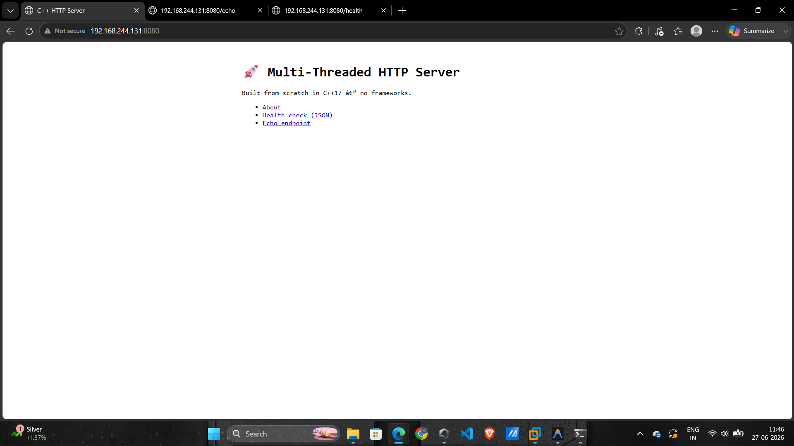

# Multi-Threaded HTTP Server in C++

A production-style HTTP/1.1 server built from scratch in C++17.  
No frameworks — only POSIX sockets, `std::thread`, `std::mutex`, and `std::condition_variable`.

## Architecture

```
Client 1 ─┐
Client 2 ─┤──► Listener (accept loop) ──► Task Queue ──► Thread Pool (N workers)
Client N ─┘                                              │
                                                         └──► HttpParser → Router → HttpResponse
```

| Component      | File                        | Responsibility                                    |
|----------------|-----------------------------|---------------------------------------------------|
| `ThreadPool`   | `src/thread_pool.cpp`       | Fixed worker threads, mutex-protected task queue  |
| `HttpParser`   | `src/http_parser.cpp`       | Parses raw TCP bytes into `HttpRequest` structs   |
| `HttpResponse` | `src/http_response.cpp`     | Builds well-formed HTTP/1.1 response strings      |
| `Router`       | `src/router.cpp`            | Matches method+path to a registered handler       |
| `Logger`       | `src/logger.cpp`            | Thread-safe timestamped stdout logger             |
| `Server`       | `src/server.cpp`            | Socket setup, accept loop, client dispatch        |

## Build

### Requirements
- Linux or macOS (POSIX sockets)
- CMake ≥ 3.15
- GCC ≥ 9 or Clang ≥ 10 (C++17 support)
- Internet connection on first build (CMake fetches Google Test)

### Build & Run

```bash
# 1. Clone / enter the project
cd http-server-cpp

# 2. Configure
cmake -B build

# 3. Compile
cmake --build build

# 4. Run on default port 8080 with 4 worker threads
./build/http_server

# Custom port and thread count
./build/http_server 9090 8
```

### Run Tests

```bash
cmake --build build
cd build && ctest --output-on-failure
```

## Available Routes

| Method | Path      | Description              |
|--------|-----------|--------------------------|
| GET    | `/`       | Home page (HTML)         |
| GET    | `/about`  | About page (HTML)        |
| GET    | `/health` | Health check (JSON)      |
| GET    | `/echo`   | Echoes request headers   |

## Test with curl

```bash
# Basic GET
curl http://localhost:8080/

# Health check
curl http://localhost:8080/health

# Echo headers
curl -H "X-Custom: hello" http://localhost:8080/echo

# 404
curl http://localhost:8080/missing

# Verbose (see full HTTP response)
curl -v http://localhost:8080/
```

## Adding a New Route

Open `src/main.cpp` and add to the route registration block:

```cpp
server.router().add("GET", "/greet", [](const HttpRequest& req) {
    return HttpResponse::make_200("<h1>Hello, World!</h1>");
});
```

## Project Structure

```
http-server-cpp/
├── CMakeLists.txt
├── README.md
├── include/
│   ├── server.h
│   ├── thread_pool.h
│   ├── http_parser.h
│   ├── http_response.h
│   ├── router.h
│   └── logger.h
├── src/
│   ├── main.cpp
│   ├── server.cpp
│   ├── thread_pool.cpp
│   ├── http_parser.cpp
│   ├── http_response.cpp
│   ├── router.cpp
│   └── logger.cpp
└── tests/
    ├── test_http_parser.cpp
    ├── test_thread_pool.cpp
    └── test_router.cpp
```

## Key Concepts Demonstrated

- **Thread pool** — fixed N workers pulling from a `std::queue` protected by `std::mutex` + `std::condition_variable`
- **POSIX sockets** — `socket()` → `bind()` → `listen()` → `accept()` → `recv()` / `send()`
- **HTTP/1.1 parsing** — raw byte stream → method, path, headers, body
- **Router pattern** — decoupled handler registration and dispatch
- **Thread-safe logging** — mutex-locked writes with timestamps
- **Graceful shutdown** — `SIGINT`/`SIGTERM` handled, workers drain before exit
- **Google Test** — unit tests for parser, thread pool, and router

## Benchmark (optional)

```bash
# Install Apache Bench
sudo apt install apache2-utils   # Ubuntu

# 10,000 requests, 100 concurrent
ab -n 10000 -c 100 http://localhost:8080/
```
### Server Home Page


### Echo Endpoint (/echo)


### Health Check (/health)


